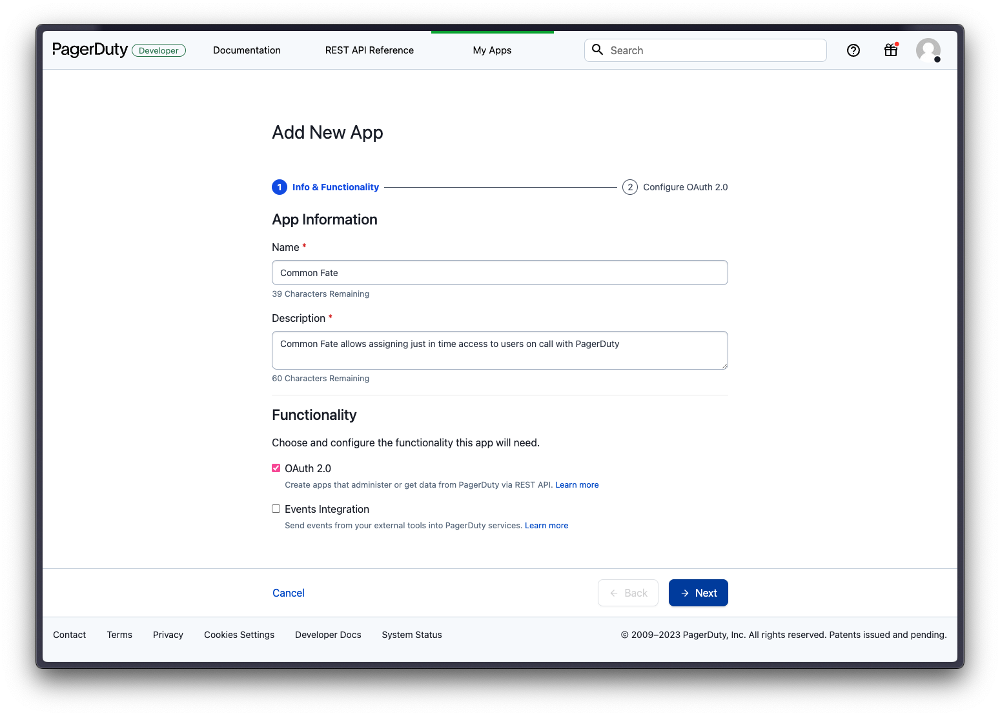

## PagerDuty and Common Fate

Common Fate integrates with PagerDuty to contextually approve access based on a user's on-call status.

## Prerequisites

To set up PagerDuty in your Common Fate deployment you will need to register an app within your PagerDuty tenancy.

1. Log into your PagerDuty account with an admin user. In the nav bar you will see an Integrations tab. Hover this and select "App Registrations".

   

2. You will be taken to the App Registrations page, next click on the "New App" button in the top left.

   

3. Here you will fill in some information about the app registration. The name can be called **Common Fate** and give any description you want. As an example: **Common Fate allows assigning just in time access to users in on-call schedules with PagerDuty.**

- Make sure you select **OAuth 2.0** for the functionality. Click next.
  

4. Under **Redirect Url's** make sure to add `<your app URL>/api/v1/oauth2/callback/pagerduty`

5. Under **Authorization** select **Scoped OAuth**.
   Under Permission Scope select `User.Read Access` `Oncalls.Read Access` `Schedules.Read Access` `Teams.Read Access`
   Click **Register App**

A modal will pop up with some client credentials. We need to save the **Client ID** and **Client Secret** to **AWS SSM Parameter Store** for it to be used in the Common Fate deployment.

You can use the AWS CLI to create a secret in the region you are deploying to, you must use the following path `"/<namespace>/<stage>/<secret name>"`

```bash
aws ssm put-parameter \
    --name "/common-fate/prod/pagerduty-client-secret" \
    --value "mySecretValue" \
    --type "SecureString"
```

Retrieve the ARN

```bash
aws ssm get-parameter \
    --name "/common-fate/prod/pagerduty-client-secret" --query Parameter.ARN

```

## Create the resource in Common Fate Terraform Config

Add the following resource into your config using the `commonfate` Terraform provider.

```hcl
resource "commonfate_pagerduty_integration" "demo" {
  name                      = "PagerDuty"
  client_id                 = <pager duty client id>
  client_secret_secret_path = <pager duty client secret parameter store ARN>
}
```

Apply the new resource with `terraform apply`

## Requirements

To integrate with PagerDuty, Common Fate will initiate an **OAuth 2.0** connection with your PagerDuty account. This connection will only use read-only access to all schedules and which users are currently on schedule.<br />

## Integration Walkthrough

### In Common Fate

1. Sign in to your **Common Fate** deployment and from the home screen, navigate to **Settings**.

   <ExpandingImage alt="test" src="/pager-duty/2.png" />

2. On the Access Controls page, scroll down to the **Integrations section**. Locate the **PagerDuty** connection and click on **Connect**. This initiates the OAuth flow to integrate PagerDuty with your Common Fate account.

   <ExpandingImage alt="test" src="/pager-duty/3.png" />

3. Enter your login details to sign in with PagerDuty, and submit consent.
   <ExpandingImage alt="test" src="/pager-duty/4.png" />
4. After logging in, you will be redirected back to the Common Fate Access Controls page, where you will notice that the PagerDuty integration is now **online**.
   <ExpandingImage alt="test" src="/pager-duty/5.png" />

## Support

If you need assistance with this integration, please contact [support@commonfate.io](mailto:support@commonfate.io), or join our Slack community [here](https://join.slack.com/t/commonfatecommunity/shared_invite/zt-q4m96ypu-_gYlRWD3k5rIsaSsqP7QMg), we're happy to help!
